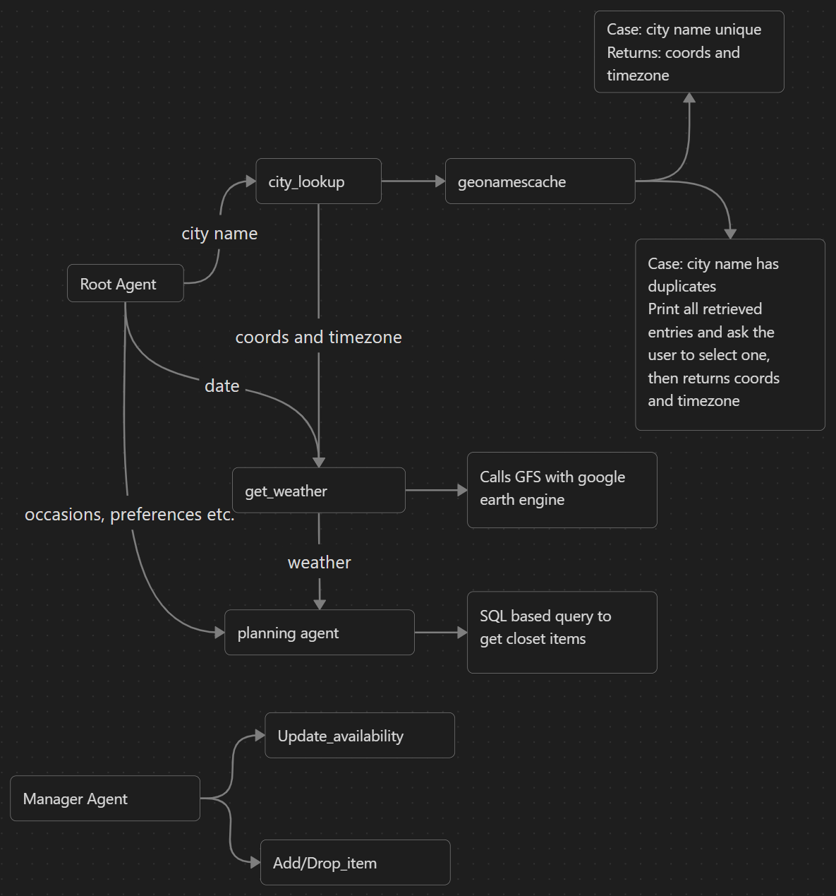

# smart-closet
This repo is designated for my capstone project submission of the [5 days AI Agent Intensive Course with Google](https://www.kaggle.com/learn-guide/5-day-agents).

## Technical Features
1. **Google Agent Development Kit (ADK)** was used to create and orchestrate agents.
2. Google Gemini models were used to process requests and to generate responses. APIs generated with Google AI Studio.
3. **Google Earth Engine**, a geospatial analysis product powered **Google Cloud**, was used to access weather data through the earth engine python API.
4. Weather data are retrieved from the Global Forecast System (GFS) (I wanted to use WeatherNext but its data requires application for accessing.)
5. The geonamescache python package was used to confirm the desired location which provides coordinates for google earth engine to access weather data. 
> Although Gemini could produce geographical coordinates reliably given the city name, it doesn't handle duplicated names very well. For example, when given an ambiguous name like "Windsor", it just assumes the user is asking for the most probable one without asking for clarification. Even when users are aware of the ambiguity and provide the agent with some extra info like "Windsor, Canada", that statement is not enough to identify the right location because it could mean "Windsor, Quebec, Canada" or "Windsor, Ontario, Canada".

## Key Agents and Tools
1. Root agent: acts as workflow manager that executes tools (including agent tools) sequentially.
==TO DO==

## Architecture

